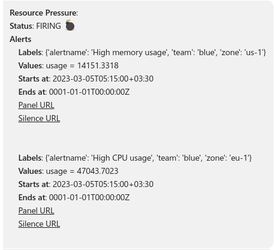
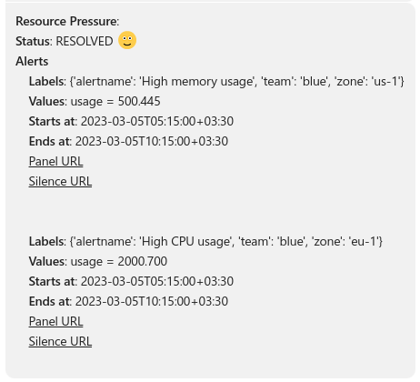

[](https://opensource.org/licenses/Apache-2.0)
 [](https://github.com/hoptical/grafana-skype-alerts/actions/workflows/ci.yml)
[](https://github.com/hoptical/grafana-skype-alerts/actions/workflows/release.yml)

# Grafana Skype Alerts
This repo provides a simple REST API to send Grafana Alert messages to skype group chats. It is designed to be used as a webhook for Grafana alert notification channel. It's response body is based on the [Grafana Webhook](https://grafana.com/docs/grafana/latest/alerting/manage-notifications/webhook-notifier/) format.


## Requirements
- Grafana 8.0 and above
- Skype account with username and password 
## Installation
You can install the app either by docker compose or helm chart. Additionally its docker image is available at [Docker Hub](https://hub.docker.com/repository/docker/hamedkarbasi/grafana-skype-alerts).

### Docker Compose
Provide the skype account username and password in the format of `example.env` file. Then run the following command:
```bash
mv example.env .env
docker compose up --build
```
The app is accessible on `http://localhost:8000`

### Helm
Provide the skype account username and password in the format of `example.env` file in a secret named `skype-secrets`. Then run the following command:
```bash
helm upgrade --install skype-notifier helm/
```

## Usage
1. Create a group chat in skype.
2. Add the skype account to that group chat.
3. Login with the skype account and accept invitation to that chat group.
4. Fetch the chat id by `/api/skype/grafana_alert/{room_name}` endpoint with GET method.
5. Post your message using `/api/skype/grafana_alert/{chat_id}` and defined body message with POST method for test purposes.
6. In the Grafana Alert Manager, create a webhook notification channel and provide the `/api/skype/grafana_alert/{chat_id}` endpoint as the URL.




> Note: Alerts are posted as summerized messages to Skype by default to make them more readable. However, you can have the whole alert message by using `verbose` option: `/api/skype/grafana_alert/{chat_id}?verbose=true`


## Docs
For endpoints documentation please visit `/docs` URI.

## Contributing

Thank you for considering contributing! If you find an issue or have a better way to do something, feel free to open an issue or a PR.

### Test
```
pytest -v
```
### Coverage
```bash
coverage run -m pytest
coverage report
```
## License

This repository is open-sourced software licensed under the [Apache License 2.0](https://www.apache.org/licenses/LICENSE-2.0).
